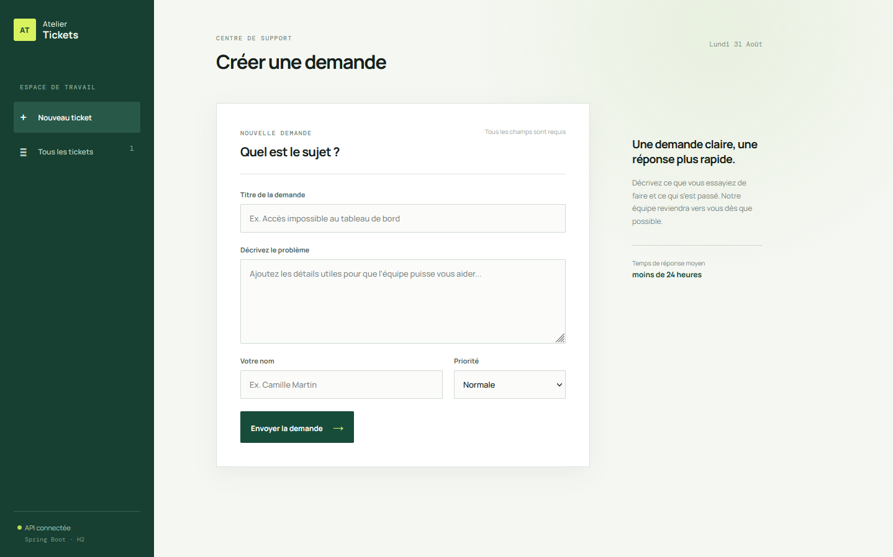
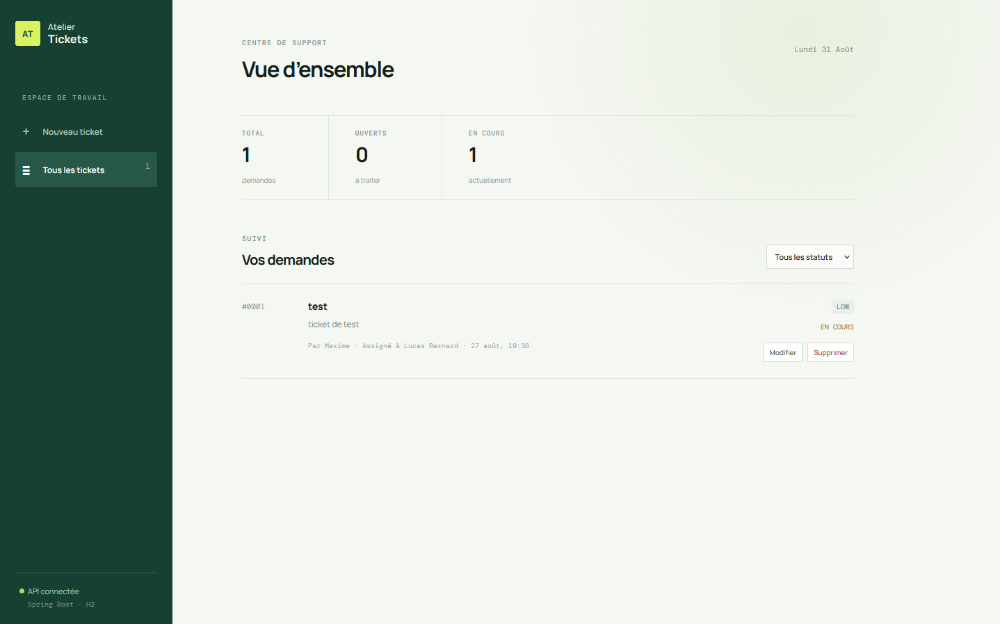
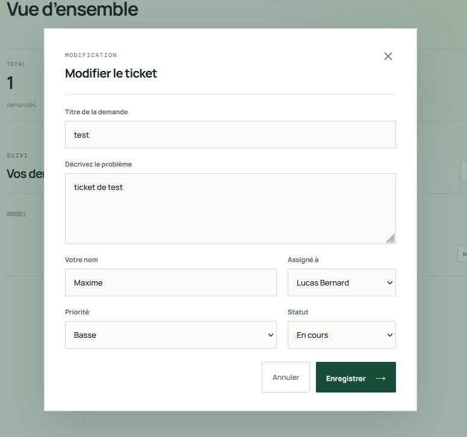

# Atelier Tickets

Application de gestion de tickets permettant de centraliser les demandes de support, les signalements de bugs et les demandes utilisateurs dans un seul espace de travail.

Le projet associe un backend Java avec Spring Boot et un frontend Vue.js pour proposer une solution simple, moderne et fonctionnelle de gestion de tickets.

---

## À quoi sert ce projet ?

Ce projet est utile pour :

- enregistrer les demandes de support ou les incidents signalés ;
- donner un suivi clair à chaque demande ;
- définir une priorité pour les tickets ;
- consulter toutes les demandes dans une interface unique ;
- modifier ou supprimer un ticket si nécessaire.

Il peut servir à un service support interne, à une équipe technique ou à un petit projet où il faut gérer des demandes de manière organisée.

### Captures d’écran

- formulaire de création d’un ticket ;

- liste des tickets avec filtres ;

- écran d’édition d’un ticket existant.


---

## Comment fonctionne le projet ?

L’application est composée de deux parties principales :

### 1. Backend Spring Boot

Le backend fournit une API REST qui permet de :

- récupérer tous les tickets ;
- créer un nouveau ticket ;
- modifier un ticket existant ;
- supprimer un ticket ;
- valider les données envoyées depuis le frontend.

L’API est exposée sur :

- `http://localhost:8080/api/tickets`

Les données sont stockées dans une base H2 locale, ce qui permet de lancer le projet sans configuration supplémentaire de base de données.

### 2. Frontend Vue.js

Le frontend propose une interface utilisateur simple et intuitive permettant de :

- créer une demande ;
- afficher la liste des tickets ;
- filtrer les tickets par statut ;
- modifier un ticket ;
- supprimer un ticket après confirmation.

L’interface est accessible sur :

- `http://localhost:5173`

---

## Stack technique

- Java 17+
- Spring Boot
- Maven
- H2 Database
- Vue.js
- Vite
- JavaScript

---

## Structure du projet

```text
project/
├── backend/
│   ├── src/main/java/          # code Java / Spring Boot
│   ├── src/main/resources/     # configuration de l'application
│   ├── data/                   # base H2 locale
│   └── pom.xml                 # configuration Maven
├── frontend/
│   ├── src/                    # composants Vue.js
│   ├── package.json            # dépendances frontend
│   ├── vite.config.js          # configuration Vite
│   └── index.html              # point d'entrée
├── README.md
└── ...
```

---

## Comment lancer le projet

### Prérequis

- Java 17+
- Maven 3.9+
- Node.js 20+

### 1. Démarrer le backend

```powershell
cd backend
mvn spring-boot:run
```

### 2. Démarrer le frontend

```powershell
cd frontend
npm.cmd install
npm.cmd run dev
```

### 3. Ouvrir l’application

Dans le navigateur, ouvrir :

```text
http://localhost:5173
```

---

## Exemple de flux de fonctionnement

1. Un utilisateur remplit le formulaire pour créer un ticket.
2. Le frontend envoie les données à l’API Spring Boot.
3. Le backend valide les informations et les enregistre dans la base H2.
4. La liste des tickets se met à jour automatiquement dans l’interface.
5. L’utilisateur peut ensuite modifier ou supprimer le ticket selon le besoin.

---

## Objectif du projet

Ce projet a été conçu pour présenter une architecture simple et pratique de type full-stack :

- API REST côté backend ;
- interface utilisateur côté frontend ;
- stockage local des données ;
- gestion basique d’un système de support ou de demandes.

Il est facile à comprendre, à lancer et à étendre avec de nouvelles fonctionnalités comme :

- gestion des utilisateurs ;
- commentaires internes ;
- statuts avancés ;
- filtres plus détaillés ;
- authentification ;
- gestion des priorités et des délais.

---

## Résumé

Ce projet est une petite application de ticketing complète permettant de gérer des demandes de support de manière simple et visuelle. Il montre concrètement comment relier un frontend Vue.js à un backend Java Spring Boot avec une base de données locale en H2.
